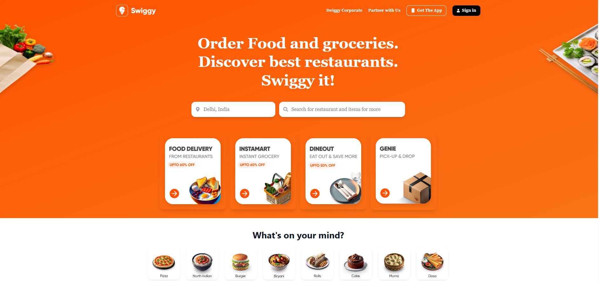
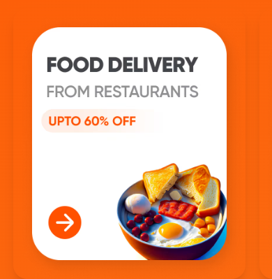
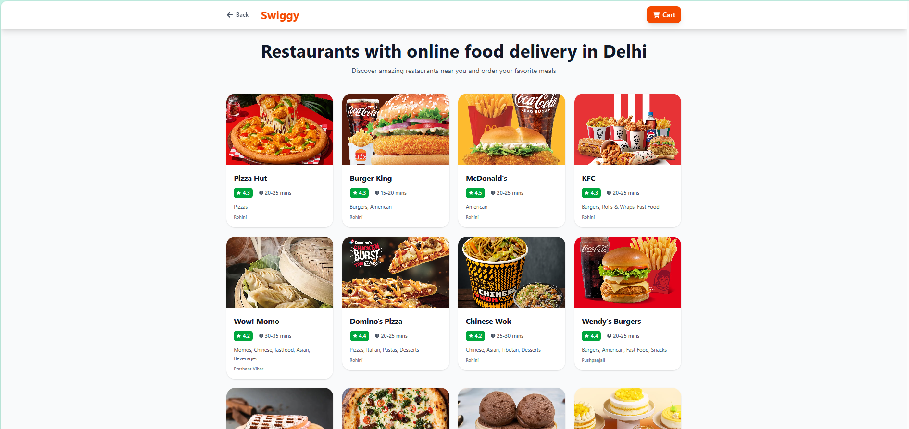
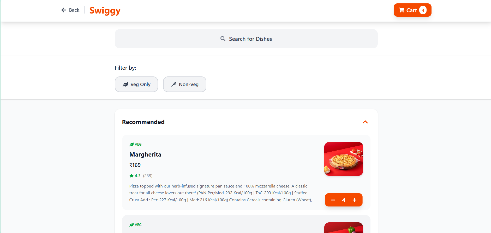
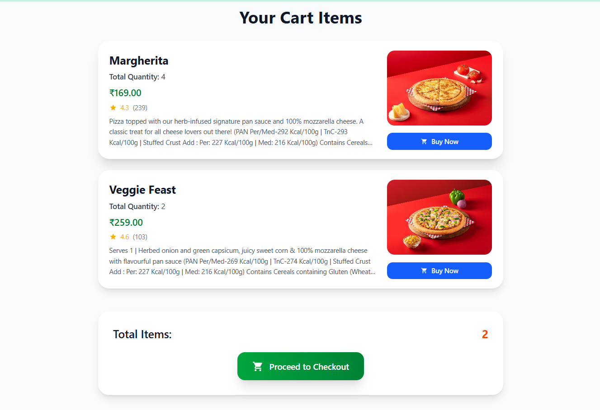

# 🍔 Swiggy Clone - Food Delivery WebApp

A modern, responsive food delivery application built with React, mimicking the popular Swiggy platform. This project features a sleek UI, restaurant listings, menu browsing, cart management, and more.


## 📸 App Navigation Flow & Screenshots

> A visual walkthrough of how users navigate through the Swiggy Clone App:

---

### 🏠 Home Page  
📍 _Landing screen with banners, categories, and restaurants_ 



---

### 🧭 Food Delivery card (Category or List View)  
📍 _Filtered restaurants based on category or search_  
➡️ Click a **Food Delivery card** ➝ goes to **Restaurants Page**



---

### 🏬 Restaurants Page (All Restaurants)  
📍 _Displays a list of all available restaurants like Pizza Hut, KFC, Burger King, etc._  
➡️ Click a **restaurant card** ➝ goes to Food Page where this restaurant's food items are shown



---

### 🍽️ Food Page (Selected Items in Detail)  
📍 _User selects a restaurant (e.g., KFC, Pizza Hut) ➝ lands here to view all available food items from that restaurant_  
➡️ Click **“Go to Cart”** ➝ navigates to **Cart Page**



---

### 🛒 Cart Page (Final Checkout)  
📍 _Final screen showing all selected items, prices, and checkout option_




## 🛠️ Tech Stack

- **Frontend:** React 18.3.1
- **Styling:** Tailwind CSS 4.1.11
- **Routing:** React Router DOM 7.6.3
- **State Management:** Redux Toolkit 2.8.2 & React Redux 9.2.0
- **Icons:** React Icons 5.5.0
- **Build Tool:** Vite 6.0.0
- **Linting:** ESLint 9.15.0

## 📁 Project Structure

```
Swiggy_clone/
├── public/
├── src/
│   ├── Components/
│   │   ├── Checkout.jsx          # Shopping cart and checkout page
│   │   ├── CheckoutCard.jsx      # Individual cart item card
│   │   ├── DineCard.jsx          # Dine-out restaurant card
│   │   ├── DineOption.jsx        # Dine-out section
│   │   ├── FoodCard.jsx          # Food category card
│   │   ├── FoodOption.jsx        # Food categories section
│   │   ├── GroceryCard.jsx       # Grocery item card
│   │   ├── GroceryOption.jsx     # Grocery section
│   │   ├── Header.jsx            # Main header with navigation
│   │   ├── Home.jsx              # Homepage component
│   │   ├── MenuCard.jsx          # Restaurant menu category
│   │   ├── Restaurant.jsx        # Restaurant listing page
│   │   ├── RestaurantMenu.jsx    # Individual restaurant menu
│   │   ├── RestCard.jsx          # Restaurant card component
│   │   ├── RestHeader.jsx        # Restaurant page header
│   │   ├── RestInfo.jsx          # Menu item details
│   │   ├── SearchFood.jsx        # Food search functionality
│   │   ├── SecondaryHome.jsx     # Layout wrapper
│   │   └── Shimmer.jsx           # Loading skeleton
│   ├── Stored/
│   │   ├── CartSlicer.jsx        # Redux cart slice
│   │   └── stores.jsx            # Redux store configuration
│   ├── Utils/
│   │   ├── DineData.jsx          # Dine-out restaurant data
│   │   ├── FoodData.jsx          # Food categories data
│   │   └── Grocery.jsx           # Grocery items data
│   ├── App.jsx                   # Main app component with routing
│   ├── App.css                   # Global styles
│   ├── index.css                 # Tailwind imports and custom styles
│   └── main.jsx                  # App entry point
├── eslint.config.js              # ESLint configuration
├── index.html                    # HTML template
├── package.json                  # Dependencies and scripts
├── README.md                     # Project documentation
└── vite.config.js                # Vite configuration
```

## ✨ Features

### 🏠 Homepage
- Modern hero section with gradient backgrounds
- Service cards (Food Delivery, Instamart, Dine Out, Genie)
- Responsive design with mobile-first approach
- Smooth animations and hover effects

### 🍽️ Restaurant Features
- Restaurant listing with ratings and delivery time
- Advanced search and filtering
- Menu browsing with categories
- Veg/Non-veg filters
- Real-time cart management

### 🛒 Shopping Cart
- Add/remove items with quantity controls
- Redux-powered state management
- Persistent cart across navigation
- Responsive checkout interface

### 🎨 UI/UX
- Modern glassmorphism design
- Tailwind CSS for consistent styling
- Loading skeletons (Shimmer effects)
- Responsive across all devices
- Smooth transitions and animations

## 🚀 Getting Started

### Prerequisites

- Node.js (v16 or higher)
- npm or yarn package manager

### Installation

1. **Clone the repository**
   ```bash
   git clone https://github.com/yourusername/swiggy-clone.git
   cd swiggy-clone
   ```

2. **Install dependencies**
   ```bash
   npm install
   # or
   yarn install
   ```

3. **Start the development server**
   ```bash
   npm run dev
   # or
   yarn dev
   ```

4. **Open your browser**
   Navigate to `http://localhost:5173` to view the application.

## 📜 Available Scripts

- `npm run dev` - Start development server
- `npm run build` - Build for production
- `npm run preview` - Preview production build
- `npm run lint` - Run ESLint

## 🔧 Configuration

### API Integration
The application is structured to use official Swiggy APIs for seamless data integration.

### API Endpoints
- **Restaurant listings:** Official Swiggy restaurant discovery API
- **Menu data:** Official Swiggy restaurant menu API  
- **Image CDN:** Swiggy's official media assets CDN

## 🌐 Routing Structure

```javascript
/ - Homepage
/restaurant - Restaurant listings
/city/delhi/:id - Restaurant menu
/city/delhi/:id/search - Menu search
/Checkout - Shopping cart
/offers - Special offers page (NEW)
```

## 🎯 Future Enhancements

- [ ] User authentication
- [ ] Order tracking
- [ ] Payment integration
- [ ] Real-time notifications
- [ ] Advanced search filters
- [ ] Favorites system
- [ ] Order history


**⭐ If you found this project helpful, please give it a star!**
